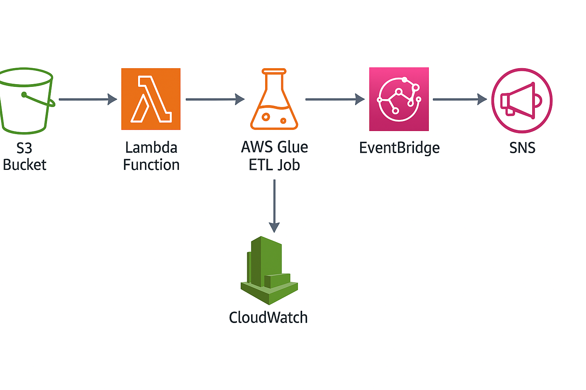

# 🚀 AWS ETL Pipeline (S3 → Lambda → Glue → EventBridge → SNS | CloudWatch Monitoring)

This project demonstrates a fully automated **ETL Pipeline on AWS**, using serverless services including **Amazon S3, AWS Lambda, AWS Glue, Amazon EventBridge, Amazon SNS**, and monitoring with **CloudWatch**.  
The pipeline ingests raw data from S3, processes it using Glue ETL jobs, triggers events through EventBridge, and sends notifications using SNS.

---

## 📌 Architecture Diagram

---

## 🏗 **Architecture Overview**

### **Components**
- **Amazon S3** – Stores incoming raw data files.
- **AWS Lambda** – Triggered when a new file arrives, starts the Glue ETL job.
- **AWS Glue ETL** – Transforms the raw data (cleaning, formatting, enrichment).
- **Amazon EventBridge** – Detects Glue job state changes and triggers SNS.
- **Amazon SNS** – Sends email/SMS notifications to users.
- **Amazon CloudWatch** – Provides monitoring, logs, and alerts.

---

## 🎯 **Project Goals**
- Build an automatic serverless ETL pipeline.
- Trigger processing when new data arrives.
- Notify users upon job success or failure.
- Use CloudWatch for complete observability.
- Design scalable, maintainable cloud architecture.

---

## ⚙️ **Workflow**

### **1️⃣ Upload File to S3**
A new file is uploaded into the **Raw Data S3 Bucket**.

### **2️⃣ Lambda Trigger**
The S3 upload event triggers Lambda, which:
- Reads file metadata  
- Starts the AWS Glue ETL Job  
- Logs execution to CloudWatch  

### **3️⃣ AWS Glue ETL Job**
Glue job:
- Extracts raw data  
- Cleans, transforms, and formats data  
- Saves processed output back to S3  

### **4️⃣ EventBridge Rule**
EventBridge listens for Glue job status changes:
- SUCCEEDED  
- FAILED  

Sends the event to SNS.

### **5️⃣ SNS Notification**
SNS sends:
- Email/SMS confirmation on success  
- Error alert on failure  

### **6️⃣ CloudWatch Monitoring**
CloudWatch provides:
- Lambda logs  
- Glue job logs  
- EventBridge logs  
- SNS delivery logs  

---

## 🧩 **Technologies Used**

| Service | Purpose |
|--------|---------|
| **Amazon S3** | Stores raw & transformed data |
| **AWS Lambda** | Triggers Glue job automatically |
| **AWS Glue** | Performs ETL transformation |
| **Amazon EventBridge** | Routes Glue job events |
| **Amazon SNS** | Sends notifications |
| **Amazon CloudWatch** | Monitoring and logging |

---

---

## 🚀 **How to Use**

### **1. Upload a data file to the S3 bucket**
This triggers Lambda automatically.

### **2. Lambda starts the Glue ETL job**
Check logs in CloudWatch → Lambda.

### **3. Glue transforms the data**
Outputs are written into the processed S3 bucket.

### **4. EventBridge triggers SNS**
SNS sends a notification based on the Glue job status.

---

## 📊 **Monitoring**
CloudWatch Dashboards include:
- Lambda execution logs  
- Glue job logs  
- SNS status  
- EventBridge rule logs  

---

## 📝 **Future Enhancements**
- Add Athena for data querying  
- Add S3 partitioning for optimized storage  
- Automate infrastructure using Terraform or CDK  
- Add Step Functions for complex pipelines  

---

## 🙌 **Author**
**B Janardhana Biliya**  
AWS | ETL | Python | Cloud Engineering  

---

